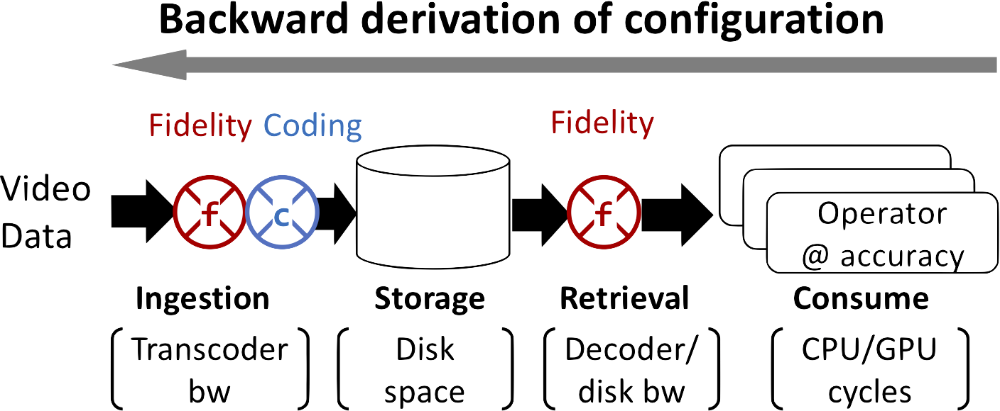

## 
VStore: A Data Store for Analytics on Large Videos

### Overview
We present VStore, a data store for supporting fast, resource efficient analytics over large archival videos.

* VStore manages video ingestion, storage, retrieval, and consumption, and controls video formats along the video data path.
* VStore explores an idea called backward derivation of configuration:
in the opposite direction along the video data path, VStore passes the video quantity and quality expected by analytics backward to retrieval, to storage, and to ingestion.
* In this process, VStore automatically derives an optimal set of video formats, optimizing for different resources in a progressive manner.
* In response to queries, VStore selects video formats catering to the executed operators and the target accuracy.
It streams video data from disks through decoder to operators.
It runs queries as fast as 362× of video realtime.

### Related Publication
**[EuroSys '19]**
Tiantu Xu, Luis Materon Botelho, and Felix Xiaozhu Lin. 2019. VStore: A Data Store for Analytics on Large Videos. In Proceedings of the Fourteenth EuroSys Conference 2019 (EuroSys '19). ACM, New York, NY, USA, Article 16, 17 pages. DOI: https://doi.org/10.1145/3302424.3303971

### Source Code
[Download](https://github.com/tiantuxu/VStore)

### People
PhD Student
* [Tiantu Xu](https://web.ics.purdue.edu/~xu944/) (lead), Purdue ECE

Undergraduate Student
* Luis Materon Botelho, Purdue ECE

Faculty
* [Felix Xiaozhu Lin](https://fxlin.github.io/), Purdue ECE

### License
All the pre-existing code and data are subject to their own licenses. All the userspace programs and kernel modules resulted from this project are under [FreeBSD license](https://opensource.org/licenses/BSD-2-Clause).
Copyright (c) 2017-2018, Purdue University
All rights reserved.

Redistribution and use in source and binary forms, with or without modification, are permitted provided that the following conditions are met:
1. Redistributions of source code must retain the above copyright notice, this list of conditions and the following disclaimer.
2. Redistributions in binary form must reproduce the above copyright notice, this list of conditions and the following disclaimer in the documentation and/or other materials provided with the distribution.

THIS SOFTWARE IS PROVIDED BY THE COPYRIGHT HOLDERS AND CONTRIBUTORS "AS IS" AND ANY EXPRESS OR IMPLIED WARRANTIES, INCLUDING, BUT NOT LIMITED TO, THE IMPLIED WARRANTIES OF MERCHANTABILITY AND FITNESS FOR A PARTICULAR PURPOSE ARE DISCLAIMED. IN NO EVENT SHALL THE COPYRIGHT OWNER OR CONTRIBUTORS BE LIABLE FOR ANY DIRECT, INDIRECT, INCIDENTAL, SPECIAL, EXEMPLARY, OR CONSEQUENTIAL DAMAGES (INCLUDING, BUT NOT LIMITED TO, PROCUREMENT OF SUBSTITUTE GOODS OR SERVICES; LOSS OF USE, DATA, OR PROFITS; OR BUSINESS INTERRUPTION) HOWEVER CAUSED AND ON ANY THEORY OF LIABILITY, WHETHER IN CONTRACT, STRICT LIABILITY, OR TORT (INCLUDING NEGLIGENCE OR OTHERWISE) ARISING IN ANY WAY OUT OF THE USE OF THIS SOFTWARE, EVEN IF ADVISED OF THE POSSIBILITY OF SUCH DAMAGE.

The views and conclusions contained in the software and documentation are those of the authors and should not be interpreted as representing official policies, either expressed or implied, of Purdue University.
